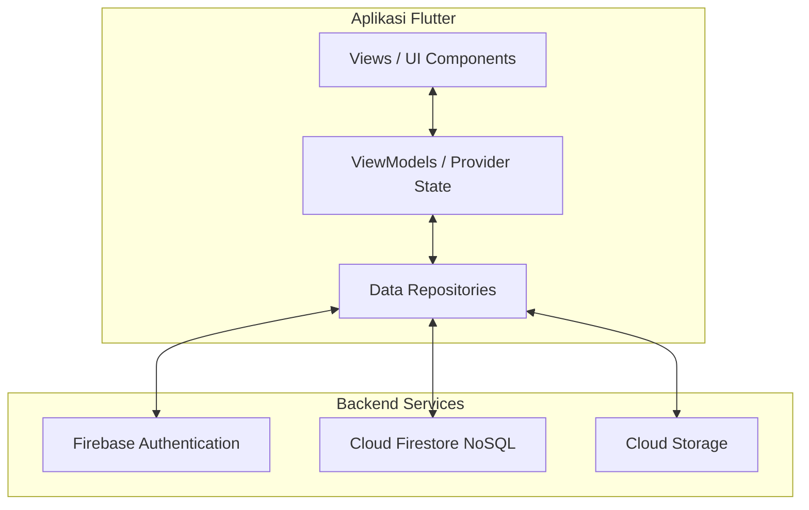
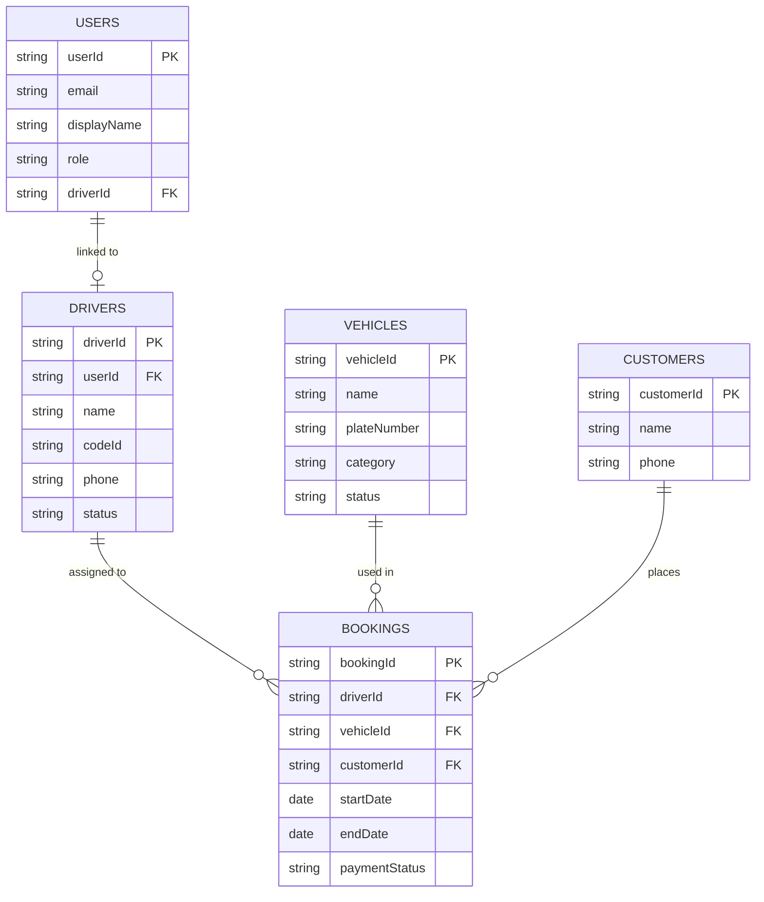

# Rentalin (Aplikasi Manajemen Rental Mobil)

[](https://flutter.dev)
[](https://flutter.dev)
[](https://firebase.google.com)

**Rentalin** adalah aplikasi mobile internal operasional untuk manajemen usaha rental mobil secara end-to-end. Aplikasi dirancang khusus untuk pemilik rental (Admin) dalam menjadwalkan armada, supir, mencatat pendapatan/piutang, serta supir (Operator) dalam memantau jadwal tugas harian mereka.

> [!NOTE]
> Aplikasi ini **bukan** untuk pelanggan publik. Distribusi dilakukan secara langsung (Direct Install) via berkas APK/IPA tanpa melalui Play Store atau App Store.

---

## 👥 Target Pengguna & Peran (Role Access)

| Peran (Role) | Target Pengguna | Hak Akses Utama |
|---|---|---|
| **👑 Admin** | Pemilik Usaha / Manajemen | Akses Penuh (CRUD Booking, Armada Kendaraan, Driver, Keuangan, & Manajemen Akun Operator). |
| **🚗 Operator** | Supir Rental | Akses Terbatas (Melihat jadwal penugasan harian & daftar armada, tanpa bisa mengedit). |

---

## 🏗️ Stack Teknologi & Arsitektur

Aplikasi dikembangkan dengan pola arsitektur **MVVM (Model-View-ViewModel)** berbasis **Provider** untuk memisahkan logika bisnis dari antarmuka pengguna:



- **Frontend Framework:** Flutter & Dart (minimum SDK v3.22)
- **Database & Auth:** Firebase Cloud Firestore & Firebase Auth.
- **Optimasi Jaringan:** Firebase Timeout Guard untuk penanganan kegagalan koneksi lambat secara elegan.
- **Penyimpanan:** Firebase Storage (untuk foto armada/dokumen).

---

## 📊 Hubungan Data (Database Schema)

Hubungan antardokumen pada Cloud Firestore dirancang sebagai berikut:



---

## 🎨 Design System (Neobank Style)

Antarmuka aplikasi mengadopsi gaya **Neobank** yang bersih, modern, dan memiliki kontras tinggi dengan panduan desain sebagai berikut:

### Skema Warna
- **Background:** Off-white / Abu-abu sangat terang (`#F9FAFB`)
- **Surface:** Putih Murni (`#FFFFFF`) dengan shadow halus
- **Primary / Aksen:** Hijau Lime/Neon (`#A3E635`)
- **Secondary:** Hitam Pekat / Abu gelap (`#1F2937`)

---

## 📌 Fitur Utama Aplikasi

### 1. Dashboard & Analitik Keuangan (Admin)
- **Metrik Utama:** Jumlah kendaraan keluar, jumlah booking baru hari ini, dan total piutang sewa.
- **Laporan Pendapatan:** Grafik visual interaktif dengan pengelompokan piutang sewa vs nominal lunas.
- **Pencarian Global:** Cari data transaksi atau armada langsung dari halaman utama.

### 2. Kalender Jadwal (Schedule Page)
- **Interactive Calendar:** TableCalendar dengan status reaktif.
- **Status Markers:** Penanda warna hijau (lunas), kuning (DP), merah (belum lunas), dan penanda titik di bawah cell kalender.
- **Visual Staggered Animation:** Transisi pergeseran (slide-up 12px) dan pemudaran (fade-in) secara bertahap saat memuat detail booking harian.

### 3. Manajemen Armada (Armada Page)
- **Pencarian Reaktif:** Mencari kendaraan berdasarkan nama atau nomor plat secara real-time.
- **Filter Kategori:** Choice chips kategori kendaraan (**Semua, Bus, Elf, Hiace, MPV, SUV, Lainnya**).
- **Pencarian Driver:** Cari driver berdasarkan nama, kode ID, atau nomor handphone.
- **Optimasi Query:** Pemrosesan filter di level ViewModel untuk meminimalisasi pembacaan dokumen (*read quota*) Firestore.

### 4. Provisioning Akun Driver (Driver Account Lifecycle)
- **Pendaftaran Driver Atomik:** Pendaftaran akun login Firebase Auth untuk driver sekaligus dokumen Firestore (`users` & `drivers`) dilakukan secara bersamaan dalam satu transaksi batch atomic untuk menghindari sisa data yatim piatu (*orphaned profiles*).

---

## 📂 Struktur Proyek (Project Directory Tree)

```text
lib/
├── core/                   # Utilitas global, tema, navigasi, dan widget standar
│   ├── navigation/         # Navigasi transisi halaman kustom
│   ├── theme/              # Warna Neobank, tipografi Poppins, bayangan kustom
│   ├── utils/              # Penanganan exception, format tanggal & rupiah
│   └── widgets/            # Widget reusable (EmptyState, Skeleton, AppChip, dll.)
├── data/                   # Logika Data, Model, dan Repositori
│   ├── models/             # Serialisasi data Firestore (User, Driver, Vehicle, Booking)
│   └── repositories/       # Abstraksi panggilan Firebase API & Local Caching
└── features/               # Fitur utama berbasis arsitektur MVVM
    ├── armada/             # Manajemen Kendaraan & Supir (Views & ViewModels)
    ├── auth/               # Autentikasi Login (Admin/Operator)
    ├── booking/            # Formulir sewa, rincian pembayaran, log aktivitas
    ├── dashboard/          # Metrik ringkasan data real-time
    ├── income/             # Laporan grafik pendapatan dan piutang
    └── schedule/           # Kalender & detail agenda penugasan
```

---

## 🚀 Panduan Memulai (Development Setup)

### Prasyarat
- Flutter SDK `>= 3.22.0`
- Akun Google Firebase dengan proyek Firestore aktif.
- NodeJS `>= v20` (jika menggunakan Firebase CLI).

### Langkah-langkah
1. **Clone repositori proyek:**
   ```bash
   git clone https://github.com/ALIFKA-HUB/ManagementRental.git
   cd ManagementRental
   ```
2. **Instal pustaka dependencies:**
   ```bash
   flutter pub get
   ```
3. **Konfigurasi Firebase:**
   Jalankan inisialisasi Firebase atau letakkan file kredensial secara manual:
   - File Android: `android/app/google-services.json`
   - File iOS: `ios/Runner/GoogleService-Info.plist`
4. **Deploy Aturan Keamanan Database & Indeks:**
   Instal Firebase CLI, lakukan login, lalu jalankan:
   ```bash
   firebase use managementrental-16b6d
   │   
   │ # Deploy Firestore Rules & Indexes
   firebase deploy --only firestore
   ```
5. **Jalankan Aplikasi:**
   ```bash
   flutter run
   ```

---
*Dokumentasi spesifikasi lengkap (PRD) dan draf rancangan implementasi terperinci dapat dilihat di folder `docs/superpowers/`.*